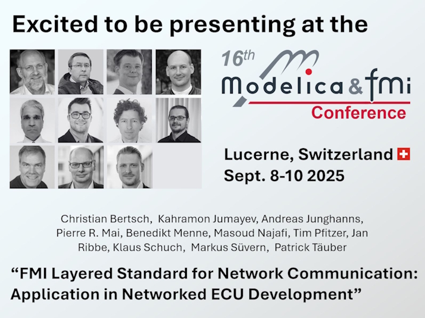

# FMI Layered Standard for Network Communication

This repository contains a current prototype draft of the FMI Layered
Standard for Network Communication (FMI-LS-BUS) based on the
[Functional Mock-up Interface][FMI] 3.0 standard for the exchange of
simulation models. Note that this draft is being worked on actively,
and thus are subject to change without notice.

This is currently not normative, nor is this document to be considered
officially endorsed by the Modelica Association or other involved
organisations prior to official adoption.

The [FMI 3.0 Layered Standard for Network Communication][spec] is currently
maintained on [GitHub][githubspec] and is based on the [FMI][] standard.
The current state of development is published [here][spec] and
contains all bus types that are currently in development or are already final.
[Official releases][releases] are directly published via GitHub.
The specification text of the latest release v1.0.0. can be accessed [here](https://fmi-standard.org/fmi-ls-bus/1.0.0/).

## News

Soon after the recent release of the FMI Layered Standard for NetworkCommunication we will be presenting this new standard and its application to networked ECU development at the coming [16th International Modelica and FMI Conference](https://modelica.org/events/modelica2025/):

Come join us, listen to the lecture, read the paper, and ask your questions!

## Roadmap

Different abstraction layers and types of buses are developed in different versions that build on each other.
Corresponding [milestones][milestones] and a detailed roadmap have
been defined for this purpose.
The following graphic provides an overview of the planned sequence of supported bus systems:

## Repository Structure

- `docs` -- Sources of the specification document
- `headers` -- Header files of the C-API
- `schema` -- XSD schema for this FMI Layered
- `tests` -- Contains unit tests for the provided header files

## Getting Started

To help you get started, we provide introductory chapters.
The following resources are currently available:

- [Getting started with CAN, CAN FD and CAN XL]
- [Getting started with FlexRay]

Our publications and presentations may also be of interest to you:

- [Beyond FMI - Towards New Applications with Layered Standards]
- FMI Layered Standard for Network Communication: Applications in Networked ECU Development: [Paper](https://raw.githubusercontent.com/modelica/fmi-ls-bus/refs/heads/main/publications/Applications_in_Networked_ECU_Development.pdf) and [Slides](https://raw.githubusercontent.com/modelica/fmi-ls-bus/refs/heads/main/publications/Applications_in_Networked_ECU_Development_Slides.pdf)

Or dive into our video ["FMI, Layered Standards and ASAM Standards - Enabling Seamless SiL Simulation of Virtual ECUs"](https://www.youtube.com/watch?v=KzzKRa3jORs).
Discover how the cutting-edge FMI 3.0 standard and the layered standards based on it are revolutionizing the world of Software-in-the-Loop (SiL) simulations.

During the presentation the three new layered standards for simulating virtual ECUs with FMI 3.0 are introduced:

- FMI-LS-XCP for measurement & calibration with XCP
- FMI-LS-BUS for simulation of network communication with CAN, CAN FD CAN XL, FlexRay, Ethernet, LIN
- FMI-LS-STRUCT for structured entities like lookup tables

After this a demo from different SiL tool vendors (Akkodis, Altair, AVL, Bosch, dSPACE, PMSF, SYNOPSYS) illustrates the interoperability of these layered standards.

## Demos

[Demo FMUs] are available within the [FMI-LS-BUS Implementers' Guide] to illustrate how to use and implement the FMI-LS-BUS.
More demos will be added iteratively in the near future.
See also the overview pages for the demos, categorized by the different supported bus types of the FMI-LS-BUS.

- [CAN, CAN FD and CAN XL Demo Overview]
- [FlexRay Demo Overview]

## FMI-LS-BUS Implementers' Guide

The [FMI-LS-BUS Implementers' Guide] is a free resource intended to give non-normative recommendations and guidance to implementers of the Functional Mock-up Interface Layered Standard for Network Communication (FMI-LS-BUS).

## Tools

The following list* shows importers and exporters that currently support the Layered Standard for Network Communication and that have been validated by a cross-check.
It should be noted that tool implementations in some cases might be experimental.
Feel free to contact the specified tool vendors if you are interested in using the FMI-LS-BUS.
Additionally, any FMU importer that supports the necessary FMI 3.0 features, such as clocks and binary variables, has generic FMI-LS-BUS support and can be used.

|Tool|Type|Features|Remarks
|---|---|---|---|
[Akkodis PROVEtech:RE](https://www.provetech.de/index.php/downloads/provetech-re)|Importer|      |Available from PROVEtech:RE 2026
[Altair Twin Activate](https://www.altair.com/twin-activate/)|Importer|      |Fmi3-Terminals are not supported
[AVL Model.CONNECT&trade;](https://www.avl.com/de-at/simulation-solutions/software-offering/simulation-tools-a-z/modelconnect)|Importer|      |-
[dSPACE SystemDesk](https://www.dspace.com/en/pub/home/products/sw/system_architecture_software/systemdesk.cfm)|Exporter| |Available since RLS 2024-B
[dSPACE VEOS](https://www.dspace.com/en/pub/home/products/sw/simulation_software/veos.cfm)|Importer|    |Available since RLS 2024-B
[MachineWare VCML Virtual Platform](https://www.machineware.de/products/vcml-virtual-platform)|Exporter||-
[tracetronic ecu.test](https://www.tracetronic.com/products/ecu-test/)|Importer|||Available since ecu.test 2025.3
[Synopsys Silver](https://www.synopsys.com/verification/virtual-prototyping/silver.html)|Importer|   |-
[Vector SIL Kit FMU Importer](https://github.com/vectorgrp/sil-kit-fmu-importer)|Importer|   |Open-source software.  Available since version 1.5
[Vector vVIRTUALtarget](https://www.vector.com/at/en/products/products-a-z/software/vvirtualtarget/)|Exporter||Available since version 9

<table>
  <tr>
    <th colspan="2" align=left>Legend</td>
  </tr>
  <tr>
    <td valign=top>
      <table>
        <tr>
          <th colspan="2">Supported system compositions</td>
        </tr>
        <tr>
          <td></td>
          <td>Direct communication</td>
        </tr>
        <tr>
          <td></td>
          <td>Composition with dedicated bus simulation FMU</td>
        </tr>
        <tr>
          <td></td>
          <td>Importer with integrated bus simulation</td>
        </tr>
      </table>
    </td>
    <td valign=top>
      <table>
        <tr>
          <th colspan="2">Supported bus types</td>
        </tr>
        <tr>
          <td></td>
          <td>High-Cut</td>
        </tr>
        <tr>
          <td></td>
          <td>Low-Cut CAN</td>
        </tr>
        <tr>
          <td></td>
          <td>Low-Cut FlexRay</td>
        </tr>
        <tr>
          <td></td>
          <td>Low-Cut Ethernet</td>
        </tr>
      </table>
    </tr>
  </td>
</table>

_* New tools within the list can be added via PullRequest from every tool vendor. Please also update the FMI tools page https://fmi-standard.org/tools/ with the entry "BUS"._

## Copyright and License

Code and documentation copyright (C) 2023-2025 The Modelica Association Project FMI.
Code released under the [2-Clause BSD License].
Docs released under [Attribution-ShareAlike 4.0 International].

## Other FMI Layered Standards

If you are interested in the FMI Layered Standard for Network Communication, the [FMI-LS-XCP] could also be relevant to you.
The [FMI-LS-XCP] specifies an FMI extension for using the XCP protocol and A2L variable description within FMUs.

[FMI]: https://fmi-standard.org/
[FMI-LS-XCP]: https://github.com/modelica/fmi-ls-xcp
[Demo FMUs]: https://github.com/modelica/fmi-ls-bus-guides/tree/main/ls-bus-guide/demos
[2-Clause BSD License]: https://opensource.org/licenses/BSD-2-Clause
[Attribution-ShareAlike 4.0 International]: https://creativecommons.org/licenses/by-sa/4.0/
[githubspec]: docs/index.adoc
[spec]: https://modelica.github.io/fmi-ls-bus/main/
[milestones]: https://github.com/modelica/fmi-ls-bus/milestones?direction=asc&sort=title&state=open
[releases]: https://github.com/modelica/fmi-ls-bus/releases
[FMI-LS-BUS Implementers' Guide]: https://modelica.github.io/fmi-ls-bus-guides/main/ls-bus-guide/
[Getting started with CAN, CAN FD and CAN XL]: https://modelica.github.io/fmi-ls-bus-guides/main/ls-bus-guide/#low-cut-can-getting-started-with-can
[Getting started with FlexRay]: https://modelica.github.io/fmi-ls-bus-guides/main/ls-bus-guide/#low-cut-flexray-getting-started-with-flexray
[CAN, CAN FD and CAN XL Demo Overview]: https://modelica.github.io/fmi-ls-bus-guides/main/ls-bus-guide/#low-cut-can-demos
[FlexRay Demo Overview]: https://modelica.github.io/fmi-ls-bus-guides/main/ls-bus-guide/#low-cut-flexray-demos
[Beyond FMI - Towards New Applications with Layered Standards]: https://ecp.ep.liu.se/index.php/modelica/article/view/947
