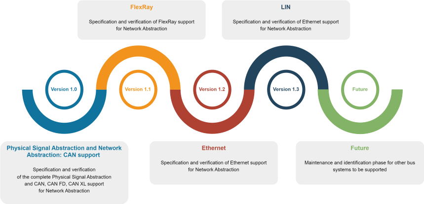

# FMI Layered Standard Network Communication

This repository contains a current prototype draft for the FMI Layered
Standard Network Communication (fmi-ls-bus) based on the 
[Functional Mock-up Interface][FMI] 3.0 standard for the exchange of
simulation models. Note that this draft is being worked on actively,
and thus are subject to change without notice.

This is currently not normative, nor is this document to be considered
officially endorsed by the Modelica Association or other involved
organisations prior to official adoption.

The [FMI 3.0 Layered Standard Network Communication][spec] is currently
maintained on [GitHub][githubspec] and is based on the [FMI][] standard.
The current state of development is published [here][spec] and
contains all bus types that are currently in development or are already final.
[Official releases][releases] are directly published via GitHub.

## Roadmap
Different abstraction layers and types of buses are developed in different versions that build on each other.
Corresponding [milestones][milestones] and a detailed roadmap have
been defined for this purpose.
The following graphic provides an overview of the planned sequence of supported bus systems:

A detailed roadmap showing completed, current and future work can be accessed [here][roadmap].

## Repository Structure
- `docs` -- Sources of the specification document
- `headers` -- Header files of the C-API
- `schema` -- XSD schema for this FMI Layered
- `tests` -- Contains unit tests for the provided header files

## Getting Started
To help you get started, we provide introductory chapters.
The following resources are currently available:

* [Getting started with CAN, CAN FD and CAN XL]

## Demos
[Demo FMUs] are available within the [FMI LS Bus Implementers' Guide] to illustrate how to use and implement the fmi-ls bus.
More demos will be added iteratively in the near future.
See also the overview pages for the demos, categorized by the different supported bus types of the fmi-ls-bus.  

* [CAN, CAN FD and CAN XL Demo Overview] 

## FMI LS Bus Implementers' Guide
The [FMI LS Bus Implementers' Guide] is a free resource intended to give non-normative recommendations and guidance to implementers of the Functional Mock-up Interface Layered Standard Network Communication (FMI-LS-BUS).

## Copyright and License
Code and documentation copyright (C) 2008-2011 the MODELISAR consortium and 2012-2024 the Modelica Association Project FMI.
Code released under the [2-Clause BSD License].
Docs released under [Attribution-ShareAlike 4.0 International].

## Other FMI Layered Standards
If you are interested in the FMI Layered Standard for Network Communication, the [fmi-ls-xcp] could also be relevant to you.
The [fmi-ls-xcp] specifies an FMI extension for using the XCP protocol and A2L variable description within FMUs.

[FMI]: https://fmi-standard.org/
[fmi-ls-xcp]: https://github.com/modelica/fmi-ls-xcp
[Demo FMUs]: https://github.com/modelica/fmi-guides/tree/main/ls-bus-guide/demos
[2-Clause BSD License]: https://opensource.org/licenses/BSD-2-Clause
[Attribution-ShareAlike 4.0 International]: https://creativecommons.org/licenses/by-sa/4.0/
[githubspec]: docs/index.adoc
[roadmap]: https://raw.githubusercontent.com/bmenne-dspace/fmi-ls-bus/main/roadmap.svg
[spec]: https://modelica.github.io/fmi-ls-bus/main/
[milestones]: https://github.com/modelica/fmi-ls-bus/milestones?direction=asc&sort=title&state=open
[releases]: https://github.com/modelica/fmi-ls-bus/releases
[FMI LS Bus Implementers' Guide]: https://modelica.github.io/fmi-guides/main/ls-bus-guide/
[Getting started with CAN, CAN FD and CAN XL]: https://modelica.github.io/fmi-guides/main/ls-bus-guide/#low-cut-can-getting-started-with-can
[CAN, CAN FD and CAN XL Demo Overview]: https://modelica.github.io/fmi-guides/main/ls-bus-guide/#low-cut-can-demos
