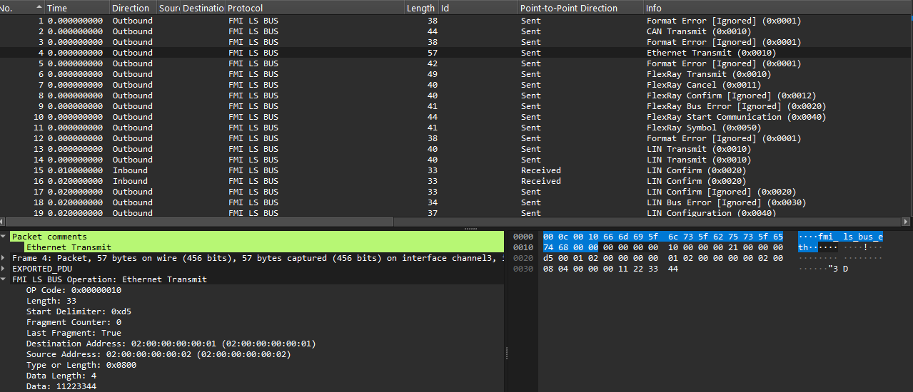

# FMI-LS-BUS Plugin for Wireshark

The FMI-LS-BUS PlugIn adds protocol support for FMI-LS-BUS to Wireshark. The plugin decodes captured FMI-LS-BUS operations and presents message contents, arguments, and status information in a structured, human-readable form instead of raw binary or hexadecimal data. This enables users to efficiently analyze and troubleshoot FMI-LS-BUS operation exchange between models.


The plugin only analyzes existing captures. The FMU or importer, such as [dSPACE VEOS](https://www.dspace.com/en/pub/home/products/sw/simulation_software/veos.cfm), must log the FMI-LS-BUS operations to a `.pcapng` file in the format expected by the plugin. Operations written to or received by an FMI-LS-BUS terminal are recorded, with the packet direction indicating the direction of each operation.



Key features include:

- Decoding of all FMI-LS-BUS operations
- Structured presentation of headers, service information, and payload data
- Display of requests, responses, and events within Wireshark’s familiar protocol tree
- Support for display filters to analyze specific operations or communication partners
- Meaningful interpretation and presentation of protocol fields and values
- Full compatibility with Wireshark’s search, filtering, and export capabilities

By integrating seamlessly into Wireshark, the FMI-LS-BUS plugin enables the user to analyze the message flow between models efficiently, identify issues more quickly, and gain deeper insight into protocol behavior. The plugin leverages the familiar Wireshark user interface and integrates naturally into existing analysis and debugging workflows.

With the FMI-LS-BUS plugin, the analysis of complex bus communication becomes significantly easier, providing a transparent and comprehensive view of all FMI-LS-BUS operations.

## Integrating the FMI-LS-BUS Plugin into Wireshark

This section describes how the provided plugin can be loaded into Wireshark.

### Prerequisites

- Wireshark is installed.
- Download `fmi_ls_bus.lua` from this homepage (see the corrosponding folder).
- Lua support is enabled in the installed Wireshark version.

---

### 1. Determine the Personal Plugin Directory

In Wireshark:

1. Open **Help** → **About Wireshark**.
2. Switch to the **Folders** tab.
3. Note the value of **Personal Lua Plugins**.

Typical directories:

#### Windows

```text
%APPDATA%\Wireshark\plugins
```

#### Linux

```text
~/.local/lib/wireshark/plugins
```

or

```text
~/.config/wireshark/plugins
```

#### macOS

```text
~/Library/Application Support/Wireshark/Plugins
```

---

### 2. Copy the Lua Script

Copy [`fmi_ls_bus.lua`](fmi_ls_bus.lua) script into the personal plugin directory.

Example:

```text
plugins/
└── fmi_ls_bus.lua
```

---

### 3. Load the Plugin via init.lua (Optional)

If the plugin should not be loaded automatically, it can be explicitly registered in the `init.lua` file.

Open or create the file and add:

```lua
dofile(DATA_DIR .. "/plugins/fmi_ls_bus.lua")
```

Alternatively:

```lua
dofile("C:/path/to/fmi_ls_bus.lua")
```

---

### 4. Restart Wireshark

After copying the script, completely close and restart Wireshark.

Lua plugins are loaded automatically during startup.

---

### 5. Verify Successful Integration

#### Using the Plugin List

Navigate to:

```text
Help → About Wireshark → Plugins
```

The Lua plugin should be listed there.

#### Checking for Errors

Navigate to:

```text
Help → About Wireshark → Folders
```

or review the startup log output.

Any syntax errors in the Lua script will be reported there.

---

### Installation Summary

1. Determine the plugin directory.
2. Copy the existing `fmi_ls_bus.lua` script into that directory.
3. Optionally load it via `init.lua`.
4. Restart Wireshark.
5. Verify that the plugin has been loaded successfully using the plugin list or logs.
